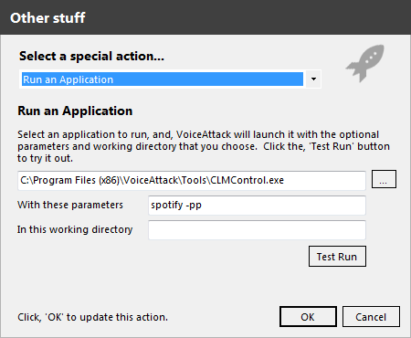

## System Requirements {anchor:requirements}
To run this application you must have the .NET Framework 3.0 or later installed on your PC. This means that Windows Vista, Windows 7, and Windows 8 users should not be required to install anything other than this application.

If you would like to use the application level audio controls you must be using Windows 7 or later.

Windows XP users may need to install the framework manual [from Microsoft](http://www.microsoft.com/en-us/download/details.aspx?id=21) 
## Installation {anchor:installation}
The application is provided as an executable within a .zip file. Simply extract the contents of the .zip file to any folder on your PC
## Usage {anchor:usage}
{{
clmcontrol <Process Name> [-p](-p) [-pp](-pp) [-pa](-pa) [-s](-s) [-vm](-vm) [-mvm](-mvm) [-vu](-vu) [-mvu](-mvu) [-vd](-vd) [-mvd](-mvd) [-nt](-nt) [-pt](-pt) [-?](-_)
}}
## Parameters {anchor:parameters}
{{
        Process Name:   The name of the process to send the message to
        -p:             Play
        -pp:            Toggle between play and pause
        -pa:            Pause
        -s:             Stop
        -vm:            Volume Mute
        -mvm:           Master Volume Mute
        -vu:            Volume Up
        -mvu:           Master Volume Up
        -vd:            Volume Down
        -mvd:           Master Volume Down
        -nt:            Next Track
        -pt:            Previous Track
}}
Note: The optional parameters have no limit to the number of times they can be repeated in the parameter list. This is especially useful for the volume controls.
## Process Names {anchor:processnames}
The process name is typically the name of the actual .exe file for a particular media player without the actually file extension (ie .exe). You can find this by looking at the path on the properties page of the shortcut you use to run the application.

Some examples of popular application process names are:
* Itunes - itunes
* Spotify - spotify
* Windows Media Player - wmplayer
* VLC - vlc

If there are spaces in the process name you must put quotation marks around the name in order for it to function properly.
## Voice Attack {anchor:voiceattack}
To use this application with Voice Attack choose Run an Application (in Other) when creating the sequence for your command. Browse to the location you extracted CLMControl.exe to and then fill in the process name and the list of commands you wish to perform.

For example to issue the Play/Pause command to Spotify you would use something like:

A [sample voice attack profile](Documentation_861358) has been included with the release. The sample assumes that you have extracted the executable to C:\Program Files (x86)\VoiceAttack\Tools\. If you have extracted the file to a different directory you will need to update the path for each of the commands in the sample.
## Limitations {anchor:limitations}
* The volume up and down commands change the volume by one tick every time it is included. You will likely want to include multiple instances of these commands when changing the volume. For example:
{{
clmcontrol spotify -vu -vu -vu -vu
}}
* Amazon Music currently does not accept the media controls using this application.
* The application must be running prior to issuing commands to it. If you are using Voice Attack you can use the same Run an Application method to start the media player that you like.